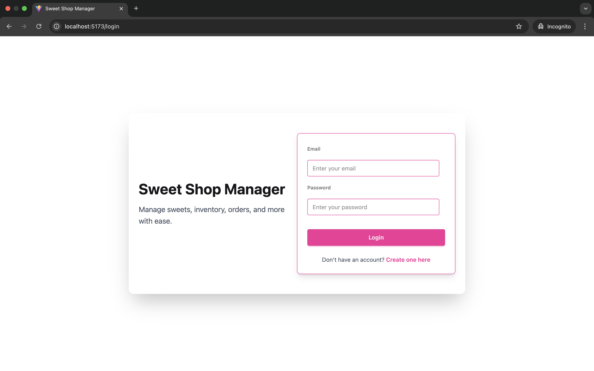
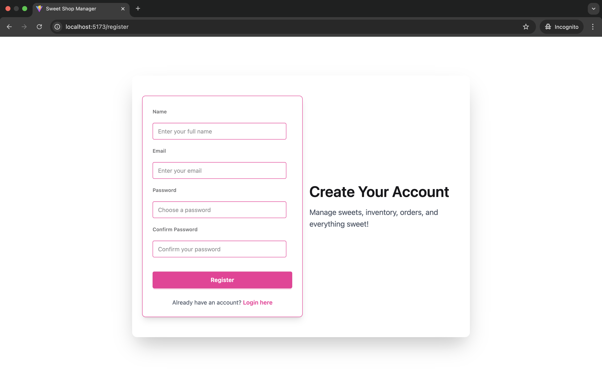
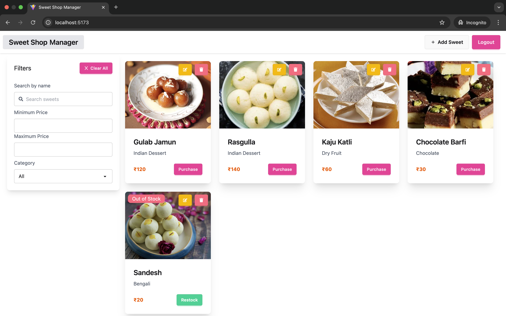
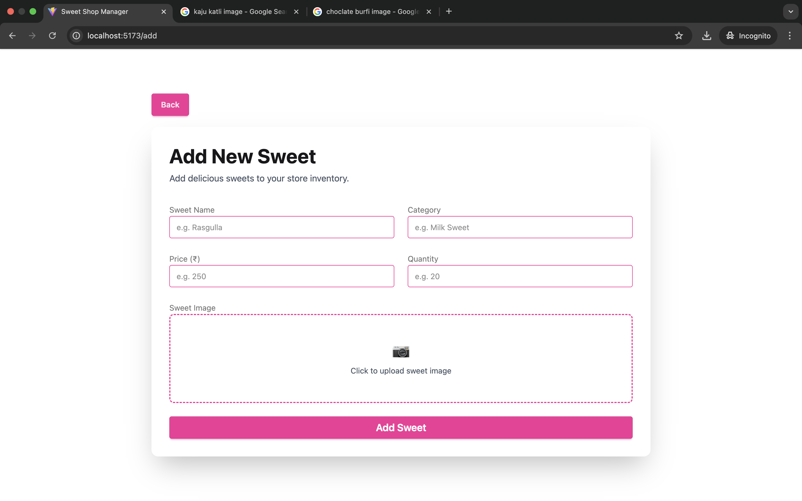
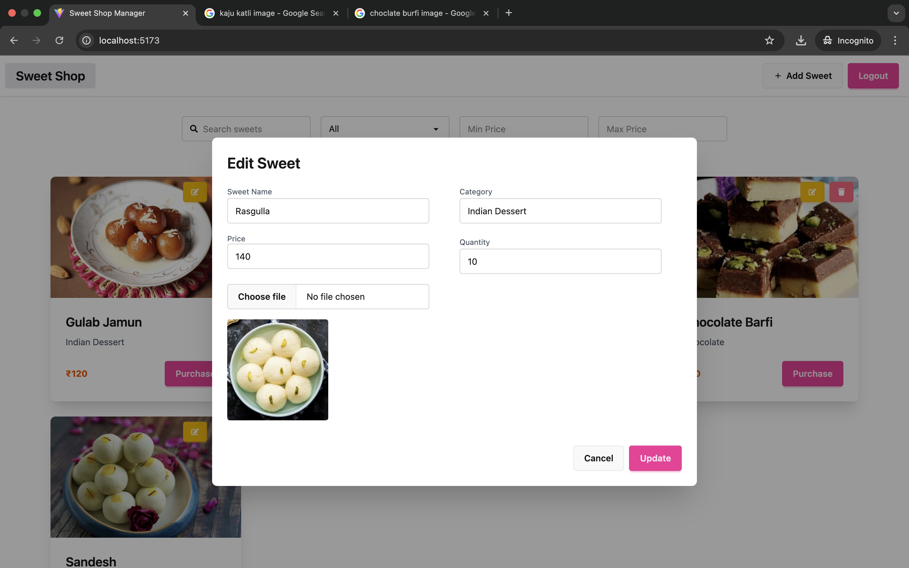
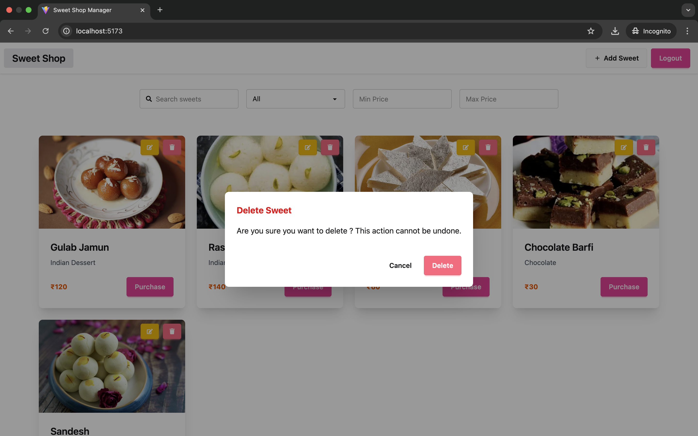

# 🍬 Sweet Shop Manager

A **full-stack Sweet Shop Management System** built to manage sweets, inventory, and users with **role-based access control**. This project was designed as a real-world assessment showcasing clean architecture, scalable backend design, and modern frontend practices.

---

## 🚀 Features

### 👤 Authentication & Authorization

- User **Register & Login** using JWT (stored securely in cookies)
- **Role-based access control** (Admin / User)
- Protected & public routes
- Auto-login on page refresh (`/api/auth/me`)

### 🍭 Sweet Management (Admin)

- Add new sweets with **image upload**
- Update sweet details using **modal-based edit**
- Delete sweets with **confirmation modal**
- View all sweets in a responsive grid

### 📦 Inventory Management

- Purchase sweets (quantity updates automatically)
- Prevent purchase when stock is empty
- Show **Out of Stock** badge

### 🔍 Search & Filter

- Search sweets by name (debounced)
- Filter by category
- Filter by min & max price
- Combined filters supported

### 🎨 UI / UX

- Modern UI using **Tailwind CSS + DaisyUI**
- Smooth animations using **Framer Motion**
- Toast notifications for actions
- Responsive design (mobile-friendly)

---

## 🧠 Tech Stack

### Frontend

- **React + TypeScript**
- **Vite**
- **Zustand** (State Management)
- **Axios** (API calls)
- **Tailwind CSS + DaisyUI** (UI)
- **Framer Motion** (Animations)
- **React Router DOM**

### Backend

- **Node.js**
- **Express.js (TypeScript)**
- **MongoDB + Mongoose**
- **JWT Authentication**
- **Multer** (File upload)
- **ImageKit** (Image storage)

---

## 📦 Important Packages

### Backend

```bash
express
mongoose
jsonwebtoken
bcryptjs
multer
cors
dotenv
imagekit
validator
```

### Frontend

```bash
react
zustand
axios
react-router-dom
framer-motion
react-hot-toast
daisyui
tailwindcss
```

---

## ⚙️ Environment Variables

### Backend `.env`

```env
PORT=8080
MONGO_URI=your_mongodb_url
JWT_SECRET=your_secret_key
IMAGEKIT_PUBLIC_KEY=
IMAGEKIT_PRIVATE_KEY=
IMAGEKIT_URL_ENDPOINT=
FRONTEND_URL=your_frontend_url
```

### Frontend `.env`

```env
VITE_SERVER_URL=http://localhost:8080
```

---

## 🛠️ How to Setup Locally

### 1️⃣ Clone Repository

```bash
git clone https://github.com/ankitjhagithub21/sweet-shop-manager.git
cd sweet-shop-manager
```

### 2️⃣ Backend Setup

```bash
cd backend
npm install
npm run dev
```

### 3️⃣ Frontend Setup

```bash
cd frontend
npm install
npm run dev
```

Frontend runs on: `http://localhost:5173`
Backend runs on: `http://localhost:8080`

---

## 🗂️ Project Structure

```
sweet-shop-manager/
├── .gitignore
├── backend/
│   ├── package-lock.json
│   ├── package.json
│   ├── src/
│   │   ├── app.ts
│   │   ├── config/
│   │   │   ├── env.ts
│   │   │   ├── imagekit.ts
│   │   │   └── multer.ts
│   │   ├── controllers/
│   │   │   ├── auth.controller.ts
│   │   │   ├── inventory.controller.ts
│   │   │   └── sweet.controller.ts
│   │   ├── interfaces/
│   │   │   ├── sweet.schema.ts
│   │   │   └── user.schema.ts
│   │   ├── middlewares/
│   │   │   ├── admin.middleware.ts
│   │   │   └── auth.middleware.ts
│   │   ├── models/
│   │   │   ├── sweet.model.ts
│   │   │   └── user.model.ts
│   │   ├── routes/
│   │   │   ├── auth.routes.ts
│   │   │   ├── inventory.routes.ts
│   │   │   └── sweet.routes.ts
│   │   ├── server.ts
│   │   ├── services/
│   │   │   ├── auth.service.ts
│   │   │   ├── inventory.service.ts
│   │   │   └── sweet.service.ts
│   │   ├── types/
│   │   │   └── express/
│   │   │       ├── custom.d.ts
│   │   │       └── index.d.ts
│   │   └── utils/
│   │       ├── jwt.ts
│   │       ├── uploadImage.ts
│   │       └── validateRegister.ts
│   └── tsconfig.json
├── frontend/
│   ├── .gitignore
│   ├── eslint.config.js
│   ├── index.html
│   ├── package-lock.json
│   ├── package.json
│   ├── public/
│   │   └── vite.svg
│   ├── src/
│   │   ├── App.tsx
│   │   ├── assets/
│   │   │   └── react.svg
│   │   ├── components/
│   │   │   ├── DeleteSweetModal.tsx
│   │   │   ├── EditSweetModal.tsx
│   │   │   ├── Loader.tsx
│   │   │   ├── Navbar.tsx
│   │   │   ├── Route.tsx
│   │   │   ├── SearchFilter.tsx
│   │   │   ├── Spinner.tsx
│   │   │   ├── SweetCard.tsx
│   │   │   └── Sweets.tsx
│   │   ├── constants.ts
│   │   ├── index.css
│   │   ├── layouts/
│   │   │   └── MainLayout.tsx
│   │   ├── main.tsx
│   │   ├── pages/
│   │   │   ├── AddSweetPage.tsx
│   │   │   ├── HomePage.tsx
│   │   │   ├── LoginPage.tsx
│   │   │   ├── NotFoundPage.tsx
│   │   │   └── RegisterPage.tsx
│   │   ├── routes/
│   │   │   ├── AdminRoute.tsx
│   │   │   ├── ProtectedRoute.tsx
│   │   │   └── PublicRoute.tsx
│   │   ├── store/
│   │   │   ├── useSweetStore.ts
│   │   │   └── useUserStore.ts
│   │   └── types.ts
│   ├── tsconfig.app.json
│   ├── tsconfig.json
│   ├── tsconfig.node.json
│   ├── vercel.json
│   └── vite.config.ts
├── readme.md
└── screenshots/
    ├── addsweet.png
    ├── deleteconfirmation.png
    ├── editsweet.png
    ├── home.png
    ├── login.png
    └── register.png

```

### Backend (Clean Architecture)

- `controllers/` → Handle HTTP requests
- `services/` → Business logic
- `models/` → MongoDB schemas
- `routes/` → API routes
- `middlewares/` → Auth & role guards
- `utils/` → JWT, image upload, validations
- `config/` → Env, multer, imagekit setup

### Frontend

- `pages/` → Route-level pages
- `components/` → Reusable UI components
- `store/` → Zustand stores
- `routes/` → Protected/Admin routes
- `layouts/` → App layout

---

## 📄 Pages Overview

### 🔐 Authentication

- Login Page
- Register Page

### 🏠 Home Page

- Navbar
- Search & filters
- Sweet listing

### ➕ Add Sweet Page (Admin)

- Form with image upload

### ✏️ Edit Sweet (Admin)

- DaisyUI modal

### 🗑 Delete Sweet (Admin)

- Confirmation modal

### 🚫 404 Page

- Friendly not found page

---

## 🧪 API Endpoints (Sample)

```http

POST   /api/auth/register
POST   /api/auth/login
POST   /api/auth/logout
GET    /api/auth/me


GET    /api/sweets
GET    /api/sweets/search
POST   /api/sweets (Admin)
PUT    /api/sweets/:id (Admin)
DELETE /api/sweets/:id (Admin)

POST   /api/inventory/:id/purchase
POST /api/inventory/:id/restock (Admin)

```

---

## 🧑‍💻 Assessment Highlights

- Clean folder structure
- Separation of concerns (Controller / Service)
- Type-safe backend & frontend
- Real-world patterns (RBAC, modals, debouncing)
- Production-ready codebase

---

## 📸 Screenshots

### Login Page



### Register Page



### Home Page



### Add Sweet Page



### Edit Sweet Page



### Deletion Confirmation Modal



---

## 🤖 My AI Usage

### 🔧 AI Tools Used

- **ChatGPT (OpenAI)**

### 🛠️ How I Used AI

- Used ChatGPT to **plan backend architecture** (controllers, services, routes separation).
- Took help in **designing REST API endpoints** for authentication, sweets, and inventory modules.
- Used AI assistance to **debug TypeScript errors**, especially around Express request typing and middleware.
- Generated **boilerplate code** for models, services, and controllers which I then customized.
- Used AI to **design UI components** using Tailwind CSS, DaisyUI, and Framer Motion.
- Helped structure **Zustand stores** for global state management.
- Assisted in writing **README documentation** and improving project explanation for assessment clarity.

### 🧠 Reflection on AI Impact

Using AI significantly **improved my productivity and learning speed**. Instead of spending excessive time searching documentation, I could focus more on **understanding concepts, writing clean code, and solving real problems**. AI acted as a **development assistant**, not a replacement—every generated solution was reviewed, modified, and integrated by me. This helped me deliver a **well-structured, production-ready project** within a limited timeframe.

---

## 🌐 Live Deployment

The Sweet Shop Manager application is fully deployed and accessible online:

### 🔹 Frontend (Vercel)

- **URL:** [https://sweet-shop-manager.vercel.app/](https://sweet-shop-manager.vercel.app/)
- Built using **React + Vite** and deployed on **Vercel**

### 🔹 Backend (Render)

- **Backend API URL:** [https://sweet-shop-manager.onrender.com](https://sweet-shop-manager.onrender.com)

- Built using **Node.js, Express, TypeScript, and MongoDB** and deployed on **Render**

> ⚠️ Note: The backend may take a few seconds to respond on the first request due to Render’s cold start behavior.

---

## 🙌 Author

**Ankit Jha**
